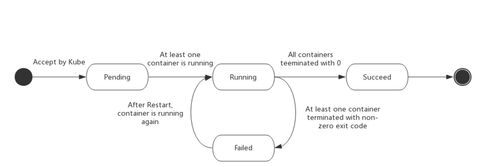

# 基本概念

### Tables of Contents

- <a href="#could_native">云原生的定义</a>
- <a href="#cloud_native_and_k8s">云原生与 Kubernetes </a>
- <a href="#k8s">Kubernetes 的基本概念</a>
  - <a href="#k8s_design">Kubernetes 的设计理念与架构</a>
  - <a href="#k8s_resource"> Kubernetes 的资源对象</a>
    - <a href="#basic_resource">Kubernetes 基本的资源对象</a>
      - <a href="#pod">Pod</a>
      - <a href="#service">Service</a>
      - <a href="#volume">Volume</a>
      - <a href="#namespace">Namespace</a>
    - <a href="#advance_resource">Kubernetes 的高级抽象资源</a>
      - <a href="#deployment">Deployment</a>
      - <a href="#stateful_set">StatefulSet</a>
      - <a href="#job">Job</a>


### <a name="#could_native">云原生的定义</a>

云原生的提出主要是为了构建和运行可弹性扩展的应用。云原生技术包括以 docker 为代表的容器技术、服务网格、微服务的技术的相互融合，这些技术能够构建容错性更好、易于管理、高可用的松耦合应用。云原生架构主要的设计理念如下：

- 面向分布式设计（基于容器的应用服务/微服务）
- 面向配置设计
- 面向韧性设计（故障容忍和自愈）
- 面向弹性设计（弹性扩展/横向扩容/收缩）
- 面向交付设计（自拉起）
- 面向性能设计（高并发/分布式）
- 面向自动化设计（自动化DevOps）
- 面向诊断性设计
- 面向安全性设计


### <a name="#cloud_native_and_k8s">云原生与 Kubernetes</a>

``Kubernetes`` 是 Google 开源的面向应用的容器集群部署与管理系统，``Kubernetes`` 的目标主要是屏蔽容器编排的计算、网络、存储等基础设施，让开发者将重点放在以容器为中心的应用上。


### <a name="k8s">Kubernetes 的基本概念</a>

#### <a name="">Kubernetes 的设计理念与架构</a>

``Kubernetes`` 的架构如下图所示：


``Kubernetes`` 主要由以下核心组件构成：

- ``etcd`` - 分布式K-V存储，保存着 ``Kubernetes`` 整个集群的状态
- ``apiserver`` - ``Kubernetes`` 提供的面向 ``Kubernetes`` 各个资源的入口
- ``controller manager`` - 负责维护集群的状态
- ``scheduler`` - ``Kubernetes``资源的调度器，负责按照预定的策略将``Pod``调度到响应的``node‵`上
- ``kubelet`` - 负责维护容器的生命周期
- ``Container runtime`` - 负责镜像（``image``）的管理及``Pod``和容器的运行
- ``kube-proxy`` - 负责为``Service``提供集群内部的服务发现和负载均衡


``Kubernetes`` 的分层架构如下：


- ``Nucleus Layer`` - 核心，如其名，这里是 ``Kubernetes`` 的核心功能，对外提供 API 构建高层应用，对内提供插件式应用执行环境
- ``Application Layer`` - 应用层，主要提供应用的部署及应用的路由（服务注册与发现）等功能
- ``Governance Layer`` - 管理层， 集群状态的监控与管理
- ``Interface Layer`` - 接口层，提供 ``kubectl`` 操作接口（command line / client / sdk）
- ``Cloud Native Ecosystem`` - 在接口层上构建的庞大的容器集群管理与调度系统


#### <a name="k8s_resource">Kubernetes 中的资源对象</a>

要是使用 ``Kubernetes`` 就需要通过 ``Kubernetes`` 对象来描述集群的预期状态（desc）, 在 ``Kubernetes`` 中对象指的是表示系统状态的抽象层，包括已部署的容器和负载、已应用相关的网络、磁盘等资源等。K8s的对象包括系统的基本对象和更高级别的抽象对象，这些对象都可以通过 K8s 提供的 API 对这些资源进行增删改查操作。

##### <a name="basic_resource">Kubernetes基本的资源对象</a>

<a name="pod">Pod</a>

``Pod`` 是 ``Kubernetes``中用户可以创建和部署的最小单位，也是``Kubernetes``中容器管理的基本单位，在``Kubernetes``上并没有这样一个实例，本身是一个抽象的概念，便于``Kubernetes``的调度和管理， ``Pod`` 可以理解为集群中运行的``进程``，``Pod``中封装着应用的容器（可以是有一个，也可以有多个）、存储、独立的网络。``Pod``代表着``部署``的一个单为， 是``Kubernetes``的一个实例。

``Pod``中可以同时运行多个进程（一般是一组相互协同的进程），同一个``Pod``中的容器会自动分配到同一个``Kubernetes`` ``Node`` 上，同一个``Pod``中的容器共享资源、网络环境、存储和依赖， 他们总是被同时调度。


##### Pod 的生命周期

如下图所示， ``Pod``主要有以下几种状态：

- Pending - 挂起，``Pod``已被``Kubernetes``系统接受，但有一个或多个容器镜像等待被创建。
- Running - 运行中，``Pod``已被调度到``Node``上， ``Pod``中所有的容器均已被正常创建，并至少有一个容器正常在运行。
- Success - 成功，``Pod`` 中所有的容器均已被成功终止。
- Failed - 失败，``Pod``中所有的容器均已被终止，但至少有一个容器是由于意外终止。
- Unknown - 未知状态， 因为某些原因集群无法获取``Pod``的状态，通常是由于``Pod``与集群通信失败



##### <a name="service">Service</a>

和``Pod``一样，``Service``也是一个抽象的逻辑，主要定义了一组``Pod``中运行的服务（Backend）的访问方式。

``Service``有以下集中类型， 也就是``Service``描述文件中``Type``的取值：

- ``ClusterIP`` - ``Service``的默认类型，通过集群内部IP暴露服务，该模式表示服务只能在集群内部访问。
- ``NodePort`` - 通过集群``Node``上的IP和端口暴露服务。
- ``LoardBalancer`` - 使用云服务商提供的负载均衡器向外暴露服务。
- ``ExternalName`` - 通过返回 `CNAME` 和它的值，可以将服务映射到 `externalName` 字段的内容。

也可以使用``ingress``来对外暴露服务，但``ingress``不是服务类型，``ingress``能作为整个集群的入口点，将整个路由规则整合到一个资源中。

一个基本的``Service``描述文件示例：

```yaml
apiVersion: v1
kind: Service
metadata:
  name: my-service
spec:
type: NodePort  # 服务类型
  ports:
    - protocol: TCP
      port: 80  # 对外暴露的端口
      targetPort: 9376  # 要暴露的容器端口
  selector:
    app: MyApp
```


##### <a name="volume">Volume</a>

``Kubernetes``中的``Volume``主要是为解决集群中容器的文件持久化问题。卷的核心是包含一些数据的目录，``Pod``中的容器可以访问该目录，卷的类型决定了这个目录的形成方式，以及目录中存放的内容。

``Kubernetes``中的卷支持多种类型，其中既包括本地卷也包括NFS等远程存储服务。具体的卷类型可以访问<a href="https://kubernetes.io/zh/docs/concepts/storage/volumes/">这个链接</a>了解。


##### <a name="namespace">Namespace</a>

命名空间为``Kubernetes``集群提供了资源隔离的策略，也是为多个集群用户之间划分集群资源的一种方法，命名空间之间不能相互嵌套，每个``Kubernetes``资源只能在一个命名空间中。大多数``Kubernetes``资源对象都应该在某一命名空间中，但也有例外，如``Kubernetes``的底层资源如``node``和``persistent volume``就不属于任何命名空间。

``Kubernetes``默认有三个初始的``Namespace``:

- ``default`` - 任何没有指定其他命名空间的资源对象默认使用的命名空间。
- ``kube-system`` - ``Kubernetes``系统创建对象使用的命名空间。
- ``kube-public`` - 这个命名空间是自动创建的，集群所有用户都可以读取。


#### <a name="advance_resource">Kubernetes 的高级抽象资源</a>

##### <a name="deployment">Deployment</a>

