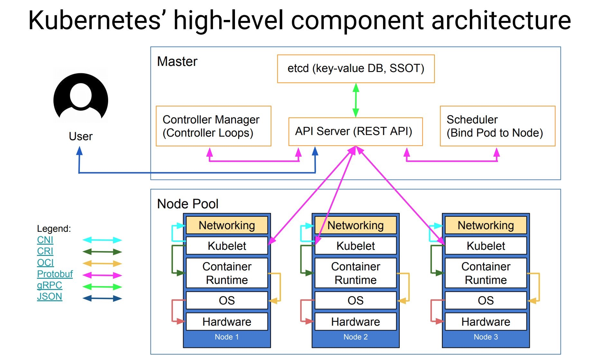

# 基本概念

### Tables of Contents

- <a href="could_native">云原生的定义</a>
- <a href="cloud_native_and_k8s">云原生与 Kubernetes </a>
- <a href="k8s">Kubernetes 的基本概念</a>
  - <a href="k8s_design">Kubernetes 的设计理念与架构</a>
  - <a href="k8s_resource"> Kubernetes 的资源对象</a>
    - <a href="basic_resource">Kubernetes 基本的资源对象</a>
      - <a href="pod">Pod</a>
      - <a href="service">Service</a>
      - <a href="volume">Volume</a>
      - <a href="namespace">Namespace</a>
    - <a href="advance_resource">Kubernetes 的高级抽象资源</a>
      - <a href="deployment">Deployment</a>
      - <a href="stateful_set">StatefulSet</a>
      - <a href="job">Job</a>

### <a name="#could_native">云原生的定义</a>

云原生的提出主要是为了构建和运行可弹性扩展的应用。云原生技术包括以 docker 为代表的容器技术、服务网格、微服务的技术的相互融合，这些技术能够构建容错性更好、易于管理、高可用的松耦合应用。云原生架构主要的设计理念如下：

- 面向分布式设计（基于容器的应用服务/微服务）
- 面向配置设计
- 面向韧性设计（故障容忍和自愈）
- 面向弹性设计（弹性扩展/横向扩容/收缩）
- 面向交付设计（自拉起）
- 面向性能设计（高并发/分布式）
- 面向自动化设计（自动化DevOps）
- 面向诊断性设计
- 面向安全性设计

### <a name="#cloud_native_and_k8s">云原生与 Kubernetes</a>

``Kubernetes`` 是 Google 开源的面向应用的容器集群部署与管理系统，``Kubernetes`` 的目标主要是屏蔽容器编排的计算、网络、存储等基础设施，让开发者将重点放在以容器为中心的应用上。

``Kubernetes`` 的架构如下图所示：

``Kubernetes`` 主要由以下核心组件构成：

- ``etcd`` - 分布式K-V存储，保存着 ``Kubernetes`` 整个集群的状态

- ``apiserver`` - ``Kubernetes`` 提供的面向 ``Kubernetes`` 各个资源的入口

- ``controller manager`` - 负责维护集群的状态

- ``scheduler`` - ``Kubernetes``资源的调度器，负责按照预定的策略将``Pod``调度到响应的``node‵`上

- ``kubelet`` - 负责维护容器的生命周期

- ``Container runtime`` - 负责镜像（``image``）的管理及``Pod``和容器的运行

- ``kube-proxy`` - 负责为``Service``提供集群内部的服务发现和负载均衡

  

